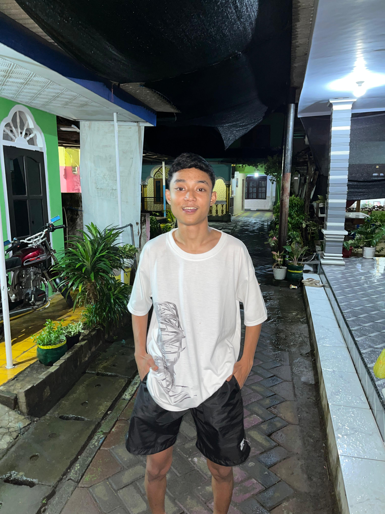

# 📸 Panduan Mengganti Foto Portfolio

Panduan lengkap untuk mengganti foto profil, background, dan gambar proyek di website portfolio Anda.

---

## 📁 Struktur Folder

```
portopolio/
├── images/
│   ├── profile/          # Foto profil Anda
│   ├── backgrounds/      # Foto background hero section
│   └── projects/         # Foto-foto proyek Anda
├── index.html
├── style.css
└── PANDUAN-FOTO.md (file ini)
```

---

## 🖼️ 1. MENGGANTI FOTO PROFIL

### Langkah-langkah:

1. **Siapkan foto profil Anda**
   - Format yang disarankan: JPG, PNG, atau WEBP
   - Ukuran yang disarankan: 500x500 px (persegi)
   - Ukuran file: Maksimal 500KB untuk loading cepat

2. **Rename foto Anda menjadi `profile.jpg`**
   - Atau bisa nama lain, tapi harus update di HTML

3. **Copy foto ke folder `images/profile/`**
   ```
   images/profile/profile.jpg
   ```

4. **Jika menggunakan nama file berbeda**, edit file `index.html` baris 47:
   ```html
   <!-- Ganti 'profile.jpg' dengan nama foto Anda -->
   
   ```
   
   Contoh jika nama file Anda `foto-saya.png`:
   ```html
   
   ```

### Tips Foto Profil:
- ✅ Gunakan foto dengan pencahayaan baik
- ✅ Background polos atau blur lebih profesional
- ✅ Foto close-up wajah atau upper body
- ✅ Compress foto untuk web (gunakan tools seperti TinyPNG)

---

## 🌄 2. MENGGANTI BACKGROUND HERO SECTION

### Langkah-langkah:

1. **Siapkan foto background**
   - Format: JPG atau PNG
   - Ukuran yang disarankan: 1920x1080 px (landscape)
   - Ukuran file: Maksimal 1MB

2. **Rename foto menjadi `hero-bg.jpg`**

3. **Copy foto ke folder `images/backgrounds/`**
   ```
   images/backgrounds/hero-bg.jpg
   ```

4. **Background sudah otomatis terpasang!**
   - CSS sudah dikonfigurasi untuk menggunakan file ini
   - Jika file tidak ada, gradient default akan tetap terlihat

### Jika Menggunakan Nama File Berbeda:

Edit file `style.css` sekitar baris 188-191:
```css
background: linear-gradient(135deg, rgba(245, 247, 250, 0.95) 0%, rgba(195, 207, 226, 0.95) 100%),
            url('images/backgrounds/hero-bg.jpg') center/cover no-repeat;
```

Ganti `hero-bg.jpg` dengan nama file Anda.

### Tips Background:
- ✅ Gunakan foto dengan kontras rendah agar teks tetap terbaca
- ✅ Foto landscape/pemandangan bekerja dengan baik
- ✅ Hindari foto dengan terlalu banyak detail
- ✅ Gradient overlay akan membuat teks lebih mudah dibaca

---

## 🎨 3. MENGGANTI FOTO PROYEK

### Langkah-langkah:

1. **Siapkan foto proyek**
   - Format: JPG atau PNG
   - Ukuran yang disarankan: 800x600 px (landscape)
   - Ukuran file: Maksimal 300KB per foto

2. **Copy foto ke folder `images/projects/`**
   ```
   images/projects/project1.jpg
   images/projects/project2.jpg
   images/projects/project3.jpg
   ```

3. **Edit file `index.html`** untuk mengganti icon dengan foto:

   **Cari bagian project card** (sekitar baris 136-138):
   ```html
   <div class="project-image">
       <i class="fas fa-laptop-code"></i>
   </div>
   ```

   **Ganti dengan:**
   ```html
   <div class="project-image">
       
   </div>
   ```

4. **Tambahkan CSS untuk foto proyek** di file `style.css`:

   Cari bagian `.project-image` (sekitar baris 420) dan tambahkan:
   ```css
   .project-img {
       width: 100%;
       height: 100%;
       object-fit: cover;
       object-position: center;
   }
   ```

### Tips Foto Proyek:
- ✅ Screenshot dari proyek asli lebih menarik
- ✅ Gunakan mockup untuk tampilan profesional
- ✅ Crop foto untuk fokus pada fitur utama
- ✅ Pastikan foto berkualitas tinggi

---

## 🎯 4. UKURAN FOTO YANG DISARANKAN

| Jenis Foto | Ukuran Ideal | Format | Ukuran File Max |
|------------|--------------|--------|-----------------|
| **Foto Profil** | 500x500 px | JPG/PNG | 500 KB |
| **Background Hero** | 1920x1080 px | JPG | 1 MB |
| **Foto Proyek** | 800x600 px | JPG/PNG | 300 KB |

---

## 🛠️ 5. TOOLS UNTUK OPTIMASI FOTO

### Compress Foto:
- **TinyPNG** - https://tinypng.com/
- **Squoosh** - https://squoosh.app/
- **Compressor.io** - https://compressor.io/

### Resize Foto:
- **Photopea** (Photoshop online gratis) - https://www.photopea.com/
- **Canva** - https://www.canva.com/
- **GIMP** (software gratis) - https://www.gimp.org/

### Membuat Mockup:
- **Mockuper** - https://mockuper.net/
- **Smartmockups** - https://smartmockups.com/
- **Placeit** - https://placeit.net/

---

## ❓ TROUBLESHOOTING

### Foto tidak muncul?

1. **Cek nama file dan path**
   - Pastikan nama file di HTML sama dengan nama file asli
   - Perhatikan huruf besar/kecil (case-sensitive)
   - Contoh: `Profile.jpg` ≠ `profile.jpg`

2. **Cek lokasi file**
   - Pastikan foto ada di folder yang benar
   - Path harus relatif dari file HTML

3. **Cek format file**
   - Gunakan format JPG, PNG, atau WEBP
   - Hindari format BMP atau TIFF

4. **Refresh browser**
   - Tekan `Ctrl + F5` (Windows) atau `Cmd + Shift + R` (Mac)
   - Clear cache browser jika perlu

### Foto terlalu besar/kecil?

Edit CSS untuk mengatur ukuran:
```css
.profile-img {
    width: 100%;
    height: 100%;
    object-fit: cover; /* atau 'contain' untuk fit tanpa crop */
}
```

### Background tidak terlihat?

1. Pastikan file `hero-bg.jpg` ada di `images/backgrounds/`
2. Cek path di CSS sudah benar
3. Jika masih tidak muncul, gradient default akan tetap terlihat

---

## 📝 CHECKLIST SEBELUM PUBLISH

- [ ] Foto profil sudah diganti dan terlihat bagus
- [ ] Background hero section sudah sesuai
- [ ] Semua foto proyek sudah diupdate
- [ ] Semua foto sudah dicompress untuk web
- [ ] Test di berbagai ukuran layar (mobile, tablet, desktop)
- [ ] Test di berbagai browser (Chrome, Firefox, Safari)
- [ ] Semua link foto berfungsi dengan baik

---

## 💡 TIPS TAMBAHAN

1. **Konsistensi Visual**
   - Gunakan style foto yang konsisten
   - Perhatikan color scheme yang seragam
   - Filter atau tone yang sama untuk semua foto

2. **Performance**
   - Compress semua foto sebelum upload
   - Gunakan format WebP untuk ukuran lebih kecil
   - Lazy loading untuk foto proyek (opsional)

3. **Accessibility**
   - Selalu isi atribut `alt` pada tag ``
   - Deskripsi yang jelas untuk screen readers

4. **Backup**
   - Simpan foto original sebelum di-compress
   - Backup folder images secara berkala

---

## 🚀 SIAP UNTUK DIPUBLISH!

Setelah semua foto diganti, website portfolio Anda siap untuk:
- Di-upload ke hosting (Netlify, Vercel, GitHub Pages)
- Dibagikan ke calon klien atau employer
- Ditambahkan ke CV/resume Anda

**Selamat! Portfolio Anda sekarang lebih personal dan profesional! 🎉**

---

*Dibuat dengan ❤️ untuk memudahkan kustomisasi portfolio Anda*
